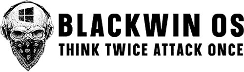

  

# BlackWin OS

> **The Ultimate Windows-Based Penetration Testing Operating System — Built by Abdal, Led by Ebrahim Shafiei (EbraSha).**

## 🧠 Introduction

**BlackWin** is a powerful cybersecurity operating system tailored for **penetration testers**, **ethical hackers**, **reverse engineers**, and **digital forensics experts**. It is uniquely based on **Windows**, rather than Linux, enabling users to leverage the Windows ecosystem while accessing an extensive suite of offensive and defensive cybersecurity tools.

The latest release, **BlackWin v4**, is built on **Windows 11** and is developed by the Iranian elite cybersecurity team **Abdal**, under the direct leadership of **Ebrahim Shafiei (EbraSha)** — a renowned expert in ethical hacking, reverse engineering, and cyber warfare.

---

## ⚙️ Features

- ✅ **Windows 11 Core**  
  Built upon a fully functional Windows 11 Pro environment, combining usability with native Windows compatibility.

- 🛠 **600+ Built-in Security Tools**  
  Covers all domains of cybersecurity:
    - Network & infrastructure exploitation
    - Reverse engineering and binary analysis
    - Web application security
    - Android & IoT hacking
    - Red Team post-exploitation tools
    - DDoS, RATs, and hardware-level exploits

- 🐚 **1000+ Shells, Payloads & Exploits**  
  A curated archive of pre-built and custom attack vectors, organized by category and target.

- 💼 **Portable, Live or Persistent Install**  
  Run as a live OS from USB or install on your system — ideal for field work and mobility.

- 💡 **User Interface Optimized for Hackers**  
  A GUI-rich interface that blends usability with power — no compromise between accessibility and performance.

---

## 👤 Developed By

- 🧠 **Team Abdal** — A leading Iranian cybersecurity collective
- 👨‍💻 **Lead Architect**: *Ebrahim Shafiei* (a.k.a. **EbraSha**)  
  Specialist in low-level systems, exploit development, AI-driven threat analysis, and ethical hacking education.

---

## 🚀 Use Cases

- Cybersecurity R&D
- Red/Blue Teaming
- Capture The Flag (CTF)
- Exploit Development
- Malware Analysis
- Cybersecurity Training Labs

---

## 📥 Installation Guide

1. Download ISO image from: [https://blackwin.ir](https://blackwin.ir)
2. Flash it using [Rufus](https://rufus.ie) or [Ventoy](https://www.ventoy.net)
3. Boot from USB or install directly to your system
4. Start testing, analyzing, and dominating the cyber terrain

---

## ⚠️ Legal Notice

> **This OS is for legal and educational use only.**  
> You are fully responsible for any unauthorized usage. Always have written permission before performing any penetration testing or exploit demonstration.

---
 
 

## 📫 Contact

- 📧 Prof.Shafiei@gmail.com
- 🌐 [https://blackwin.ir](https://blackwin.ir)

---

> **BlackWin** — Strategic cyber power, crafted by **Abdal**, guided by **EbraSha**.
